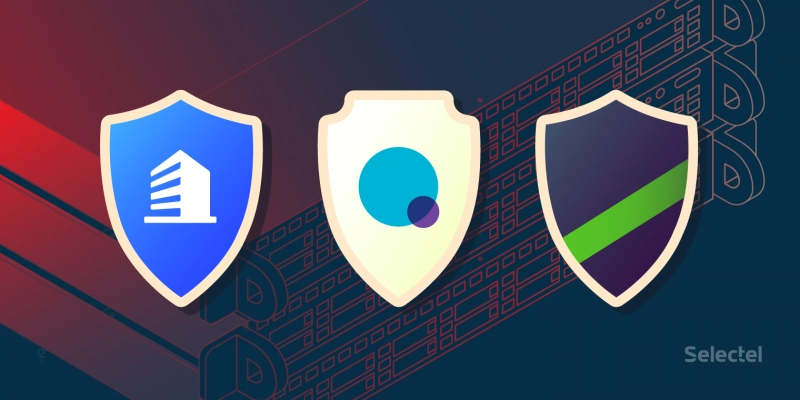
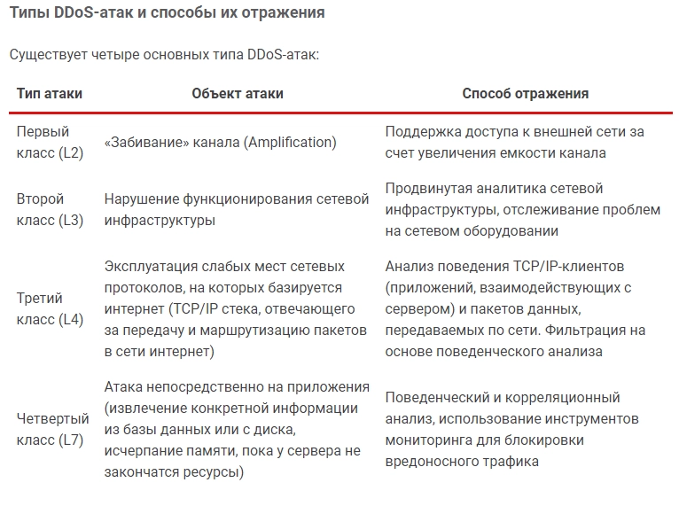
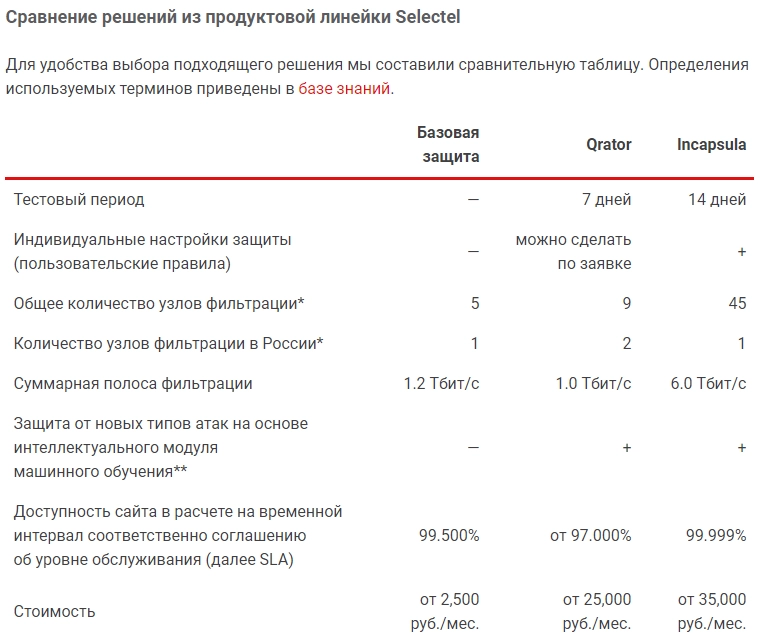

# DDoS防护：从基础到全面，你的网站需要哪一层保护?

---

做生意的都知道，网站一旦打不开，损失可不是一点半点。现在组织一场DDoS攻击太容易了——花几欧元就能让你的网站瘫痪几分钟。问题是，该上什么级别的防护?这篇文章会告诉你：根据你的业务规模，选对防护方案，不花冤枉钱也不留安全漏洞。

---

## DDoS攻击有多普遍？看看数据就知道了

DDoS（分布式拒绝服务攻击）这个词听起来很专业，但原理很简单：通过大量无效请求堵塞你的服务器，让真正的用户进不来。谁会这么干？可能是竞争对手、黑客勒索，也可能只是无聊的人找乐子。

卡巴斯基实验室的数据显示，2018年9月的DDoS攻击数量比2017年同期增长了5倍。更糟糕的是，现在有大量"DDoS租赁服务"，按秒计费——5分钟125Gbps的攻击只要5欧元。你的网站能扛住吗？

## 防护方案怎么选？对症下药才是关键

大多数公司没有技术团队自己搞定DDoS防护，所以会选择专业服务商。核心原则是：**防护成本不应该超过被攻击造成的损失**。

简单说，如果你只是个小博客或初创网站，没必要上最贵的方案；但如果你是电商平台或金融服务，那就别省这点钱了。

让我们看看不同规模业务适合什么样的防护：

### 1. 基础防护：适合小型网站和初创项目

基础防护主要应对L2和L3层攻击——这类攻击试图通过堵塞带宽让你的网站瘫痪。如果你开启了"应用层防护"，还能防御L7层攻击。

**注意一个细节**：如果你的网站用HTTPS加密协议（现在大多数网站都用），启用L7防护时需要把SSL证书交给防护服务商。为什么？因为没有证书，他们没法过滤加密流量——这就像快递员不拆包裹就没法检查里面有没有违禁品。

**适合谁**：个人博客、小型企业官网、流量不大的电商网站

### 2. 通用防护（Qrator方案）：适合中型业务

通用防护能应对大部分DDoS攻击类型，可以长期承受多次攻击。但有两种情况它搞不定：
- **多向量攻击**：攻击者从L3层突然切换到L7层，像打游击战一样变来变去
- **持久攻击**：连续不断的小规模攻击，一波接一波

👉 [想了解如何应对复杂DDoS攻击场景？看看专业级防护方案能帮你做什么](https://cp.gthost.com/en/join/72c7e6b2fc118929f9ede2978f008806)

好消息是，如果遭遇应用层攻击，系统会自动切换到对应的防护模式，不需要你手动操作。

**适合谁**：中型电商、SaaS平台、内容网站、游戏服务器

### 3. 全面防护（Incapsula方案）：适合大型企业和高风险业务

如果你经常被攻击，或者业务特别重要（比如金融、医疗、政府服务），那就需要全面防护。Incapsula能防御所有类型的DDoS攻击，还有额外功能：

**WAF（Web应用防火墙）**  
专门保护通过HTTP/HTTPS传输数据的应用，阻止黑客入侵和SQL注入

**管理后台保护**  
即使管理员密码被盗，攻击者也进不了后台——这层保护对企业系统特别重要

**全球CDN加速**  
内置内容分发网络，不仅防攻击还能加速网站访问

**智能负载均衡**  
自动分配流量到不同服务器，无论是同一个数据中心还是跨地域部署都能优化

**适合谁**：大型电商、金融科技、在线教育平台、企业级应用

## 最后说两句

DDoS攻击的成本越来越低，但你的业务损失可能很高。选防护方案就像买保险：小网站用基础防护够了，业务越大风险越高就得上更强的方案。

如果你还在犹豫选哪个级别，可以先从基础防护开始，随着业务增长再升级。记住一点：👉 [Gthost这类专业服务商能根据你的实际需求定制方案，不用自己瞎折腾技术细节](https://cp.gthost.com/en/join/72c7e6b2fc118929f9ede2978f008806)——把时间花在发展业务上更值得。
